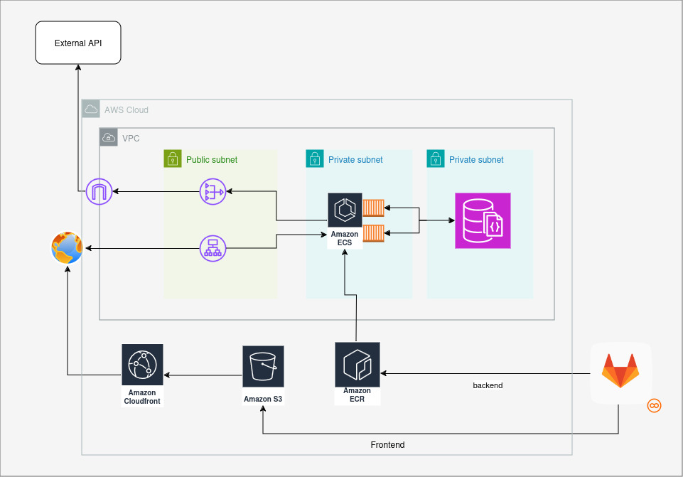

# TodoListo!
Todolisto is test a project.
It has a 3-Tiers architecture composed of frontend, backend and database

The frontend it's developed with React.js, and the backend is in Python with FASTAPI Framework, The database is mongo.

The choice of using mongodb it's determinated from the nature of data to save. A text with few fields.

# Table of Contents
- [Requirements](#requirements)
- [How to Start](#how-to-start)
- [Environment Variables](#environment-variables)
  - [Backend Variables](#backend-variables)
  - [Frontend Variables](#frontend-variables)
- [Backend](#backend)
  - [Project Structure](#project-structure)
- [Frontend](#frontend)
  - [Project Structure](#project-structure-1)
- [Infrastructure in cloud](#infrastructure)
  - [Frontend](#frontend-deployment)
  - [Backend](#backend-deployment)
  - [Database](#database)
  - [Possible Integrations](#possible-integrations)
- [Useful Links](#useful-links)

# Requirements 

- [docker](https://www.docker.com/)
- [docker compose](https://docs.docker.com/compose/)

# How to start

1. clone repository:

    `git clone git@github.com:dpiada/todolisto.git`

2. change project directory:

    `cd todolisto`

3. create own `.env` file: 
    - `cp .env.example .env`
    - fill the enviroments variable with your values\
    **Important:** see [Environment Variables](#environment-variables) section

4. run docker compose

    `docker compose up`


# Environment Variables

## Backend Variables

`MONGO_HOSTNAME`

- Description: Specifies the hostname or IP address of your MongoDB server. This is the address where your MongoDB instance is running.
    
- Example: `localhost` or `mongodb://192.168.1.100`.

`MONGO_PORT`

- Description: The port number on which the MongoDB service is listening. By default, MongoDB uses port 27017, unless configured otherwise.

- Example: `27017`.

`MONGO_USERNAME`

- Description: The username used to authenticate against the MongoDB database. This is required if authentication is enabled for your MongoDB instance.
- Example: `admin` or `myUser`.

`MONGO_PASSWORD`

- Description: The password associated with the `MONGO_USERNAME` used to authenticate against the MongoDB database.
- Example: `yourSecurePassword`.

`MONGO_DB_NAME`

- Description: The name of the database within MongoDB that your application will be interacting with. If the database doesn't exist, MongoDB will create it automatically when the first document is inserted.    
- Example: `myAppDB` or `productionDatabase`.

`MONGO_COLLECTION_NAME`

- Description: The name of the collection in your MongoDB database where data is stored. Collections are analogous to tables in relational databases.
- Example: `task`

## Frontend Variables

`REACT_APP_BASE_URL`

- Description: The base URL for your backend API that the frontend application will communicate with. This variable allows you to easily configure different environments (development, staging, production) without hardcoding the URL into your application.

- Example: https://api.example.com or http://localhost:5000.


# Backend

The backend is developed in Python using the FastAPI framework. This choice was made due to its lightweight nature and its ability to deliver high performance in building APIs.

## Project Structure

The project follows a well-organized folder structure to maintain modularity and clarity. Below is the description of each component in the scaffold:
```
root/
│
├── Dockerfile
├── requirements.txt
├── models/
│   └── [Object Models for Validation]
├── provider/
│   └── [File and External Service Communication]
├── routes/
│   └── [API Route Handlers]
└── main.py
```

- Dockerfile

Contains the necessary instructions to build the Docker image for the backend service, ensuring a consistent deployment environment.

- requirements.txt

    A file listing all the dependencies required to run the backend. This is essential for setting up the development and production environments.

- models/

    This folder contains the object models used for data validation in FastAPI. These models define the structure and constraints of the data that the API accepts and returns. FastAPI uses Pydantic models for request and response validation.

- provider/

    This folder serves as the interface to external services, such as databases, file storage, or other third-party services. Although the name provider might be a bit ambiguous, it refers to a layer that handles interactions with these external resources. Consider renaming it to something more specific, like services or external_communicators, for better clarity.

- routes/

    This folder contains all the route definitions for the API. Each route corresponds to a specific HTTP endpoint and is responsible for handling requests and responses, leveraging FastAPI's path operation decorators.

- main.py

    The entry point of the application. This file contains the FastAPI app instance and includes the startup logic for running the application, configuring routes, middleware, and other initializations.
# Frontend

Frontend is written with React.js in addition I used react-bootstrap.


## Project Structure

The project follows a well-organized folder structure to maintain modularity and clarity. Below is the description of each component in the scaffold:
```
root/
│
├── Dockerfile
├── package.json
├── package-lock.json
├── public/
│   └── [Static assets]
└── src/
    └── components
    │   └── [objects to render in page]
    ├── App.js 
    └── index.js
```

- Dockerfile:

    Contains the necessary instructions to build the Docker image for the backend service, ensuring a consistent deployment environment.

- package.json: 
    
    Manages project dependencies, scripts (like npm start), and other configurations.
- package-lock.json: 
    
    Ensures consistent dependency versions across installations.
- public/: 
    
    Contains static files (e.g., index.html, favicon, logos), which are served directly.
- src/: 

    Where the core React application lives, including components and logic.

    - components:
    
        Stores individual UI components that are reused throughout the app.
    - App.js: 
    
        The root component that organizes and renders other components.
    - index.js: 
    
        The entry point that initializes and renders the entire app into the HTML 

# infrastructure

In a cloud contenxt I'd use something like this



**The frontend** 
- is deployed on aws s3 distribuited from a cdn, this allow us to keep bucket private.

**The backend**
- use an ecr to upload and store images
- Ecs to deploy container and get image from ecr
- Application loadbalancer to expose API
- Nat Gateway to reach external Services

**Database**
- document DB managed because support mongodb

**Possible Integrations**
- it can be use cognito userpool and link to ALB to support a kind of authentication

**Links**

- [3-tier architecture](https://docs.aws.amazon.com/whitepapers/latest/serverless-multi-tier-architectures-api-gateway-lambda/three-tier-architecture-overview.html)
- [ECR - ECS - ELB](https://docs.aws.amazon.com/codepipeline/latest/userguide/tutorials-ecs-ecr-codedeploy.html)
- [FE on s3](https://docs.aws.amazon.com/prescriptive-guidance/latest/patterns/deploy-a-react-based-single-page-application-to-amazon-s3-and-cloudfront.html)
- [ Gitlab to ECR](https://forum.gitlab.com/t/ci-cd-docker-image-to-aws/77386)
- [ALB e cognito](https://repost.aws/it/knowledge-center/cognito-user-pool-alb-authentication)


# Useful links

- [quote generator](https://dummyjson.com/)
- [mongo](https://www.mongodb.com/resources/languages/python)
- [mongo-fastapi](https://www.mongodb.com/developer/languages/python/python-quickstart-fastapi/)
- [pydantic](https://docs.pydantic.dev/latest/)